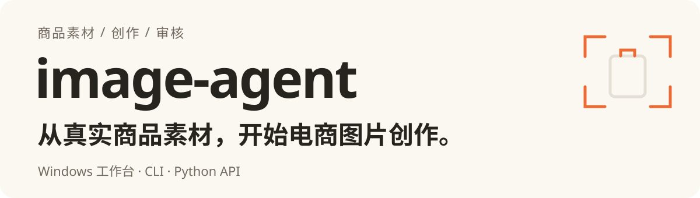
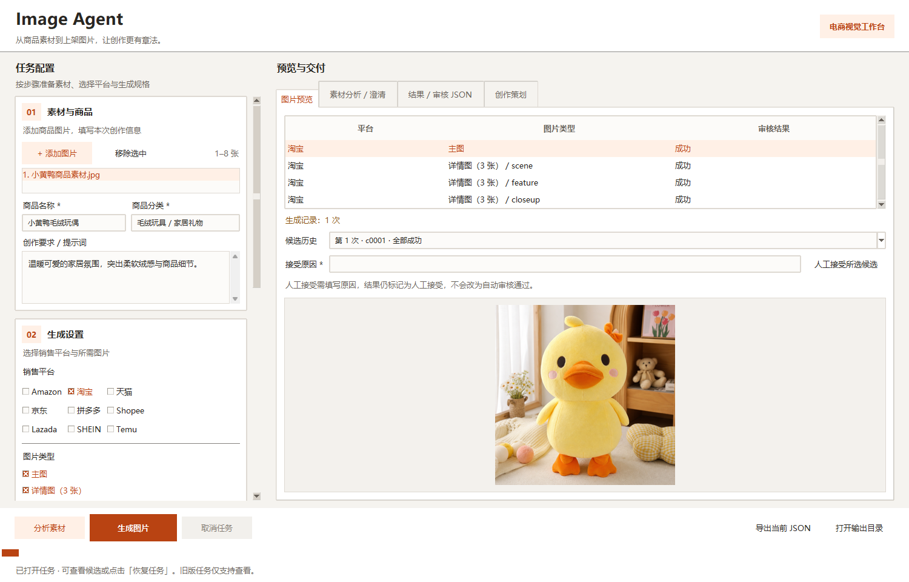
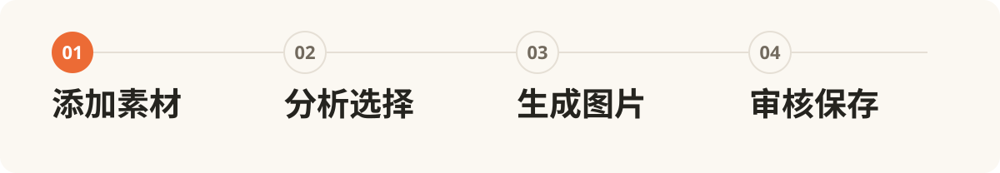

# image-agent

<p align="center">
  
</p>

独立的商品图片创作 Python 包。添加多张素材，选择商品主体与要素，生成主图、详情图或拼多多白底图，再查看审核结果与候选历史。

<p align="center">
  <a href="./assets/readme/desktop-workbench.png"></a>
</p>

<sub>桌面工具打开本地历史任务的实际截图。画面展示已保存的候选与审核结果；点击图片查看原尺寸。</sub>

**Python ≥3.12 · Windows 桌面测试工具 · 本地 SQLite 检查点 · MIT**

[快速上手](#快速上手) · [命令行](#命令行) · [Python 接入](#python-接入) · [技术参考](#技术参考) · [开发与验收](#开发与验收)

## 从素材到交付

<p align="center">
  
</p>

1. **添加素材** — 输入 1–8 张商品视角、细节、配件或场景图片，以及商品信息和创作要求。
2. **分析与选择** — 发现主体与要素，查看创作策划；遇到澄清问题时选择方案或补充素材。
3. **生成图片** — 按平台与输出类型编译参考证据，生成主图或三张详情图，默认最多 2 轮定向质量修复。
4. **审核与保存** — 查看逐图状态、审核 JSON 和候选历史；指定输出目录后可恢复任务或人工接受候选。

支持淘宝、天猫、京东、拼多多、Amazon、Shopee、Lazada、SHEIN 和 Temu。平台规则与自动评分用于创作和审核辅助，真实上架验收仍需人工看图。

## 快速上手

在项目根目录创建环境并安装：

```powershell
python -m venv .venv
.venv\Scripts\python.exe -m pip install .
.venv\Scripts\python.exe scripts/desktop.py
```

环境就绪后，也可双击 **[start-desktop.cmd](start-desktop.cmd)** 启动。桌面工具使用 Tkinter 与 Pillow，无需启动后端服务。

1. 添加本地素材，填写商品名称、分类和创作要求。
2. 选择平台、输出类型、模型、尺寸与比例。
3. 在「API 配置与输出」加载配置 JSON，并为对应服务填写 API Key。官方示例使用 [examples/config.openai.json](examples/config.openai.json)，配置了 `fast` 生图模型；也可使用 [OpenRouter 示例](examples/config.openrouter.json)。
4. 点击「分析素材」查看发现与策划，处理澄清后「生成图片」；也可直接生成。
5. 在右侧查看图片与审核结果，点击「打开输出目录」查看保存文件。已有任务可直接打开，恢复时使用当前加载的配置。

官方示例显式配置了 `http://127.0.0.1:7890` 代理；其他电脑请改为可用地址，或在可以直连时删除 `http_proxy` 字段。修改配置后重新加载。界面密钥仅在当前进程内使用，重新加载配置会清空密码框。

**分析、生成与恢复会调用真实 API，可能产生费用。** 本地历史任务可直接查看；离线测试不代表真实账号权限或出图质量。下载到的候选不一定通过审核，请同时检查资产状态。

<details>
<summary><strong>桌面工具完整操作、响应诊断与候选处理</strong></summary>

在项目根目录双击 **`start-desktop.cmd`**，或运行：

```powershell
.venv\Scripts\python.exe scripts/desktop.py
# 已安装 image-agent 时也可使用：
python -m image_agent.desktop
```

使用 Python 自带 Tkinter 和已有 Pillow，无需安装 Electron 或启动后端服务。
首次使用需要已创建 `.venv` 并安装本项目；缺少环境时双击脚本会显示安装命令。

1. 添加 1–8 张本地素材，填写商品名称、分类和创作要求。
2. 勾选平台及输出类型，选择模型、尺寸、比例。默认淘宝主图，配置为官方 OpenAI 示例。
3. 向下滚动左侧参数区，在「API 配置与输出」选择并加载配置 JSON。
   模型列表随配置更新；每个服务单独填写 API Key，留空则读取该服务配置或其环境变量。
   官方示例的 `official_images` 与 `official_vision` 可填同一个 OpenAI 密钥；也可提前设置 `OPENAI_API_KEY`。
   界面输入的密钥仅在本次进程内使用，不写配置或环境；重新加载配置会清空密码框。
4. 点击「分析素材」查看发现结果，或直接「生成图片」。分析出现澄清选项时，在「素材分析 / 澄清」选择方案后继续生成；
   没有可选方案时补充素材或修改要求后重新分析。素材、商品信息和提示词变化会清除旧分析。
   「创作策划」页会区分用户要求的原文摘录与模型补充建议，并显示场景、构图、光线、配色、商品展示重点和氛围的建议及理由。
   策划复用素材分析的同一次模型调用，将「高级感、适合电商」等笼统要求细化为可执行的视觉方向；只补充未指定的细节。
   建议自动进入生图提示词，用户要求、商品外观、选定素材、镜头规则和平台规则优先；白底图仅采用适用的光线建议。
   补充建议不会变成必须通过的审核项，也不会添加用户未提供的商品性能或营销声明。
   策划保存在分析及 `result.json` 的 `analysis.creative_plan` 中。旧分析仍可读取，但需重新分析才能生成策划；模型未返回策划时会提示并沿用默认拍摄要求。
5. 右侧查看图片与审核 JSON，点击「打开输出目录」查看核心自动保存的图片和 `result.json`。
   可导出当前分析/结果 JSON；失败时表单保留，部分成功与保存错误会明确显示。
   没有生成图片时，图片预览页会直接显示首张失败图片的原因，可点击列表切换。
   图片响应解析失败会记录请求的服务主机、接口路径、协议、模型、请求格式和参考图数量，
   以及出错字段、内容类型、长度和格式分类（空值、网址、数据前缀、空白或无效编码）。
   诊断同步保存在结果 JSON；不保存密钥、完整图片数据或带签名的图片网址。
   更新代码后需关闭并重新打开测试工具，旧结果无法补回当时未记录的响应信息。
   生图接口返回图片网址（包括 `b64_json` 为空且同时有 `url`）时，会自动下载、校验后继续审核和保存。
   下载不携带 API 密钥或会话 Cookie；下载失败不会重新提交生图请求。
   视觉响应缺少必需字段或审核项、或含矛盾重复项时，在同一接口、同一批图片上纠正一次；仍失败会指出步骤和字段。无害多余项和安全格式差异不触发额外调用。
   已生成且可解码的图片不会因后续审核报错被丢弃：失败候选图保存到本次输出目录的
   `candidates/` 子目录，界面明确标注「未通过审核」。它们不计入成功数量；第三方图片包可下载候选，但必须保留未通过或未审核的状态及警告。

6. 点击「打开已有任务」选择任务目录，查看历史结果及候选；点击「恢复任务」使用当前加载的配置继续。阶段与尝试次数在底部显示，停止原因在图片说明中显示。选择候选历史可切换预览；填写人工接受原因后点击「人工接受所选候选」，结果单独标注人工接受，不计为自动通过。旧 JSON 可查看，恢复仅适用于带有效 v2 检查点的任务。

分析、生成和恢复都会调用配置中的真实 API，可能产生费用。测试套件使用离线替身，不代表真实账号权限或出图质量。
任务期间可取消；关闭窗口会先取消并等待清理。已保存候选与检查点保留；恢复前请检查本次任务目录，提交状态不确定的请求需人工处理。

</details>

## 命令行

在当前终端输入官方 OpenAI 密钥，再生成一张淘宝主图：

```powershell
$env:OPENAI_API_KEY = [System.Net.NetworkCredential]::new('', (Read-Host 'OpenAI API key' -AsSecureString)).Password
.venv\Scripts\python.exe -m image_agent create `
  --config examples/config.openai.json --model fast `
  --material "C:\images\product.jpg" --name "陶瓷杯" --category "厨房用品" `
  --platform taobao --output main_image --out out
```

多图重复 `--material`；详情图使用 `--output detail_page`。本地结果写入 `out/<任务ID>/result.json`，自动通过的图片位于 `approved/`，其他候选保留在 `candidates/`。

<details>
<summary><strong>CLI 参数、JSON 输入与退出码</strong></summary>

```powershell
image-agent create --material front.jpg --material back.jpg `
  --name "陶瓷杯" --category "厨房用品" --brief "保持正面图案和背面结构" `
  --platform taobao --output main_image --out out

image-agent analyze --material front.jpg --name "陶瓷杯" --category "厨房用品" `
  --platform taobao --output main_image --out analysis

image-agent create --product shirt.jpg --reference style.jpg `
  --name "亚麻衬衫" --category "女装上衣" --platform taobao --output detail_page `
  --presentation model_wear --model-preference no_face --model fast --size 2K --out out
```

CLI图片只接受本地路径。`--platform`、`--output`、`--reference`、`--material`可重复；支持`--market`、`--aspect`、`--style`、`--analysis analysis/analysis.json`。退出码：0 全部自动通过；1 失败、质量未通过、参数或输出错误；2 部分成功；3 待补充输入；4 人工接受；5 待审核或审核异常；6 预算耗尽；7 生成提交状态不确定；130 取消。聚合为 partial 时返回 2，仍需读取逐资产状态。终端不打印长提示词，完整追踪保留在JSON。

</details>

## Python 接入

```python
import asyncio
from image_agent import (
    AgentConfig, CreationRequest, ImageSource, MaterialInput, create_images,
)

request = CreationRequest(
    product_name="陶瓷杯", category="厨房用品",
    materials=[
        MaterialInput(material_id="front", source=ImageSource(path="front.jpg")),
        MaterialInput(material_id="back", source=ImageSource(path="back.jpg")),
    ],
    creative_brief="保留商品外观，制作干净的电商主图",
    platforms=["taobao"], output_types=["main_image"],
    image_model="fast", output_dir="out",
)
config = AgentConfig.from_file("examples/config.openai.json")
result = asyncio.run(create_images(request, config=config))
for asset in result.assets:
    print(asset.asset_id, asset.status)
```

API 接受本地路径、HTTP(S) URL 和原始 `bytes`。每个 `ImageSource` 只使用一种来源。CLI、桌面工具和 Python API 共用核心流程；本地 SQLite 保存任务检查点，无需部署数据库、队列或 Web 服务。

## 技术参考

需要接入或调整行为时，展开对应参考。下方保留完整配置约定、素材选择规则、审核边界和恢复语义。

<details>
<summary><strong>环境变量与默认配置</strong></summary>

```powershell
python -m venv .venv
.venv\Scripts\python.exe -m pip install .
$env:IMAGE_AGENT_OPENROUTER_API_KEY = "your-key"
.venv\Scripts\image-agent.exe --help
```

不自动加载 `.env`，不读取通用 `HTTP_PROXY` 或来源项目配置。`.env.example` 仅供手动配置参考。真实客户端建立时才要求密钥，测试无需真实凭证。

| 环境变量（均以 `IMAGE_AGENT_` 开头） | 默认值 |
| --- | --- |
| `OPENROUTER_API_KEY` | 无，建立客户端时必填 |
| `OPENROUTER_BASE_URL` | `https://openrouter.ai/api/v1` |
| `MODEL_PRO` | `google/gemini-3.1-flash-image` |
| `MODEL_FAST` | `openai/gpt-image-2` |
| `MODEL_BASE` | `qwen/qwen-image-3-pro` |
| `QUALITY_MODEL` | `openai/gpt-4o-mini` |
| `STYLE_MODEL` | 跟随 QUALITY_MODEL |
| `HTTP_PROXY` | 无 |
| `REQUEST_TIMEOUT_SECONDS` | 180 |
| `MODEL_CONCURRENCY` | 2，每个真实图片模型进程内共享 |
| `GENERATION_REFERENCE_LIMIT` | 4 |
| `VISION_IMAGE_LIMIT` | 12 |

后两项是部署容量声明，不是供应商实测能力。同模型别名共用并发额度；重叠请求若声明不同额度，明确报配置错误。请求内部始终串行。

</details>

<details>
<summary><strong>服务路由、协议与真实 API 测试</strong></summary>

部署配置与商品请求分离：`services` 定义地址、协议、密钥来源；`image_models` 把
`pro` / `fast` / `base` 别名绑定到服务和实际模型；`stages` 定义视觉阶段路由。
可以只配置实际使用的别名。未配置别名、未知阶段/服务或协议不匹配均报配置错误。
更换同协议兼容服务时，只改配置中的 `base_url`、`api_key_env`、`model` 即可。

官方示例为 [examples/config.openai.json](examples/config.openai.json)：生图固定使用
`gpt-image-2`，发现和审核使用 `gpt-4o-mini`。在项目根目录运行（真实调用会计费）：

该示例已为当前开发电脑显式配置 `http_proxy: "http://127.0.0.1:7890"`。
在其他电脑使用时，改为可用的 HTTP 代理地址；可以直连时删除该字段或设为 `null`。
程序不会自动继承 Windows 系统代理。桌面工具修改配置后，需点击「加载配置」并重新填写界面密钥。

```powershell
# 在当前终端安全地输入 OpenAI 官方密钥，不要使用 OpenRouter 的密钥。
$env:OPENAI_API_KEY = [System.Net.NetworkCredential]::new('', (Read-Host 'OpenAI API key' -AsSecureString)).Password
.venv\Scripts\python.exe scripts/live_smoke.py --live --config examples/config.openai.json --material "C:\images\product.jpg" --name "陶瓷杯" --category "厨房用品" --brief "保留商品外观，制作干净的电商主图" --out out
# 完整 CLI；官方示例只配置了 fast，因此必须指定 --model fast。
.venv\Scripts\python.exe -m image_agent create --config examples/config.openai.json --model fast --material "C:\images\product.jpg" --name "陶瓷杯" --category "厨房用品" --platform taobao --output main_image --out out
```

多图重复 `--material`；详情图用 `--output detail_page`，会生成三张并做成组审核。
`live_smoke` 默认 `fast`。输出仍为 `out/<自动生成ID>/result.json` 及成功图片。
OpenRouter 示例见 [examples/config.openrouter.json](examples/config.openrouter.json)，仍需该平台的独立密钥及模型权限。

同时生成主图和详情图时，同平台整套图片共享场景、光线、色调和模特设定。审核通过的场景主图
会作为副图的视觉参考，副图通过景别、构图、动作和局部特写区分用途。仅生成详情图、主图未通过
审核或主图须使用白底时，由第一张审核通过的场景详情图建立参考。该关联随任务检查点保存，
重试和恢复时继续使用。成组审核也检查场景和人物是否连贯。

商品原始素材始终优先；参考图容量不足时会提示场景关联降级为共享文字设定，不挤掉必需商品证据。
此流程复用已有创意分析，不增加专门的场景策划模型调用。真实场景连续性仍需以供应商出图效果为准。

配置优先级明确且不做隐式合并：Python 显式 `config` 或 CLI `--config` 使用完整显式配置；
未传配置才使用旧 `IMAGE_AGENT_*` 环境变量和旧默认值。JSON 配置中的标量省略时使用库默认值，
不会被旧环境变量覆盖；密钥仅读取服务指定的 `api_key_env`。也可在 Python 中传 `api_key=SecretStr(...)`，
二者不能同时指定。不自动加载 `.env`，不同服务不借用密钥，失败不自动更换供应商。

```python
from image_agent import AgentConfig, create_images

config = AgentConfig.from_file("examples/config.openai.json")
# 或由调用方从数据库、配置中心读取同样结构的 dict；无需部署数据库服务。
# config = AgentConfig.from_mapping(deployment_record)
request.image_model = "fast"
result = await create_images(request, config=config)
```

Python 也可直接构造 `AgentConfig(services=..., image_models=..., stages=...)`，嵌套字段接受
字典或导出的 `ServiceConfig` / `ModelRoute` 对象；旧 `AgentConfig(openrouter_api_key=...)` 仍兼容。
结构化配置不能混入旧 provider/model 字段，以免两套来源互相覆盖。
配置入口不会打印密钥；文件读取/格式错误会转换为配置错误。

`stages.vision` 为必需默认路由，可分别覆盖 `analyze_materials`、`validate_evidence`、
`extract_garments`、`describe_style`、`audit_image`、`review_product`、`audit_detail_set`。
每项都是 `{"service": "服务名", "model": "模型名"}`。
创建客户端前检查本次选中图片服务及全部配置的视觉路由密钥；未选择的备用图片模型与未被路由引用服务不需要密钥。
单独 `analyze` 不检查生图密钥。视觉路由预检包含本次可能没有进入的可选审核阶段。

支持三种协议：`openrouter_images`（JSON `/images`）、`openai_images`（有参考图 multipart
`/images/edits`，无参考图 JSON `/images/generations`）、`chat_completions`（视觉 JSON）。
服务可指定 `generation_path`、`edit_path` 或 `chat_path` 改写默认端点，路径拼接到 `base_url`。
兼容性指这些具体请求/响应格式；任意不同协议仍需新增适配器。
GPT Image 2 不传 `input_fidelity`，1K/2K/4K 对应 low/medium/high 质量，画布按比例单独计算：
1:1 为1024×1024、3:4 为768×1024；两边是16的倍数，满足官方像素范围。
4:1 / 1:4 在官方图像协议中明确报能力错误。结构化风格路由不会暗中回退模型；旧配置保留既有风格降级行为。

离线测试已覆盖发现→官方 multipart 生图→审核→落盘，不能证明真实账号权限或生图效果。
现有 OpenRouter HTTP 403 仍需依据该平台返回原因和账号权限处理；更换配置本身不代表该问题已解决。

</details>

<details>
<summary><strong>多图输入、素材角色与创作约束</strong></summary>

```python
import asyncio
from image_agent import CreationRequest, ImageSource, MaterialInput, create_images

request = CreationRequest(
    product_name="陶瓷杯", category="厨房用品",
    materials=[
        MaterialInput(material_id="front", source=ImageSource(path="front.jpg")),
        MaterialInput(material_id="back", source=ImageSource(path="back.jpg")),
        MaterialInput(material_id="lid", source=ImageSource(path="lid.jpg")),
    ],
    creative_brief="杯盖放在杯子旁，不扣上",
    platforms=["taobao"], output_types=["main_image"],
)
result = asyncio.run(create_images(request))
for asset in result.assets:
    if asset.image is not None:
        print(asset.asset_id, len(asset.image))
```

API 接受本地路径、HTTP(S) URL、原始 `bytes`，每个 `ImageSource` 恰好一种来源。默认不落盘。调用方可传 `AgentConfig(...)`，无需依赖环境变量。

新输入支持 1–8 张，`role_hint` 默认 `auto`，可指定 identity/detail/accessory/scene/style。同一商品三个视角应归并为一个主体，保留不同事实来源；不同商品不会默认全部入图。明确双商品组合、配件摆放与否定要求由一次视觉发现产生结构化意图。

旧 `product_image=ImageSource(...)` 加最多 4 张 `reference_images` 仍可用，与 `materials` 互斥。旧参考图全部参与风格分析，普通资产只使用第一张风格图；白底和 Amazon 主图不使用风格参考。

用户提供的营销说辞直接作为创作输入。`creative_brief`、`style_hint`、素材的
`subject_hint` / `element_hints` 和商品描述原样传入生成提示词；默认不核查用户提供的
卖点、数字、排名、认证和夸张表达，不索要证明、不纠正或弱化措辞，也不添加免责声明。
用户明确要求生成的营销文字可进入画面，审核和修复不会因说辞缺少事实依据而删改它。
只有用户明确要求核查时，模型指令才允许核查营销说辞。

发现模型将用户营销说辞记为 `user_input` 来源或独立 `marketing_claim` 约束，
这些内容不要求素材给出视觉证明，也不产生「无法验证声明」提示。明确要求写上的文案
仍检查是否按要求呈现；缺字、漏字会定向修复，但不检查文案真假。
商品可见外观、素材身份与引用、图片尺寸和画质仍按原流程检查；原有安全关键词拦截和
品牌/IP 提醒仍保留。

商品外观以原始商品素材为准。卖点和文案可以自由表达，但不会被当作新增商品结构、
图案、材质细节或配件的依据；场景装饰与商品本身分开。普通生成、修复和审核共用这条约束。
只有正面素材时优先保留正面展示，通过背景、光线、构图和裁切制造差异；有对应素材才展示
侧面、背面或内部细节，特写不补全模糊区域。正常光影、小幅透视变化、自然穿戴褶皱和遮挡
允许保留。审核检查明显新增或改造的商品细节，即使整体相似度较高也进入现有一致性修复；
不因模糊区域或细微渲染差异单独判商品不符；低分仍可触发现有有界修复，结束后保留带状态的候选。

</details>

<details>
<summary><strong>分析快照、主体选择与澄清恢复</strong></summary>

```python
from image_agent import analyze_materials, SelectionSpec

async def select_then_create(request):
    analysis = await analyze_materials(request)
    if analysis.status == "failed":
        return analysis
    # 展示 analysis.subjects / elements / issues，让调用方选择真实 ID。
    if analysis.status == "needs_input":
        choices = [o for i in analysis.issues for o in i.options if o.selection]
        if not choices:
            return analysis  # reanalyze：先补充素材或修改 brief
        request.selection = choices[0].selection  # 实际产品中由用户选择
    else:
        proposal = analysis.intent.proposal
        request.selection = SelectionSpec(
            mode="explicit",
            **proposal.model_dump(exclude={"primary_subject_id"}),
        )
    return await create_images(request, analysis=analysis)
```

精确选择必须携带同一分析快照，不能拿新发现的 ID 猜测对应。`Issue.options[].selection` 是完整可提交的 explicit 选择；不需要解析中文标签。无法拆开的混合身份必须重新分析，不能删掉冲突事实蒙混过关。

快照 fingerprint 覆盖字节、顺序、素材角色/提示、商品信息、brief、style_hint 和规则版本 `multi-image-r3-user-marketing`。改 selection 或目标平台不使快照过期，换素材/brief/style_hint 或规则版本会抛 `StaleAnalysisError`，需重新分析。hash 不是信任证明：回传快照始终重新核对真实素材、可见外观与用户意图；用户营销声明不在事实复核范围内。旧 `needs_input` 可以通过合法选择和复核恢复。

一个 Fact 内的 evidence 是 OR（替代视角任选其一）；多个必需 Fact 是 AND（全部覆盖）。代表图先占槽，再补齐事实来源；例如正面商标和背面拉链不能互相替代。审核会保留其他相关视角，不只看生图使用的那几张。

`required_element_ids` 和 brief 中必需要求对**每张请求资产**生效。镜头只能豁免默认身份可见范围，不能豁免用户 required。必需场景与白底冲突、杯盖与不兼容微距冲突时，只失败对应资产；可选场景在白底中排除并记原因。纯氛围没有视觉事实时保留为约束，不伪造证据。

</details>

<details>
<summary><strong>平台规则、审核阈值与质量修复</strong></summary>

支持 amazon、taobao、tmall、jd、pinduoduo、shopee、lazada、shein、temu。平台大小写与首尾空格会规范化，重复项按首次出现去重。市场按首平台推断：国内平台 CN，Shopee/Lazada SG，其余 US。

输出顺序固定：`main_image` → `detail_page`（scene、feature、closeup）→ `pdd_white_background`。每类按输入平台顺序。白底必须选择 pinduoduo，且只生成一个资产；固定纯商品、无模特偏好，导出精确 480×480 PNG、<3 MiB 后再审核。主图与详情保留供应商原始字节，按文件头写 `.png`、`.jpg`，其他可解码格式 `.img`。

每资产参考顺序：主身份代表图 → 其他可见主体代表图 → 必需事实来源 → 可选细节/配件 → 场景 → 风格。去重且不截断必需证据，容量不足返回 capability。可选要素仅能文字传递时记录 `text_only_element_ids`。审核图像集合加生成图超过视觉容量也明确失败。

逐主体审核要求 `same_product=true` 且一致性 ≥85，**95 分但 false 仍失败**；身份确认且 80–84 分时最多一次聚焦复核。必需细节/配件保真 ≥85，视觉/平台 ≥70，适用的服装融合/模特偏好 ≥80，镜头意图 ≥75。低分用于有界修复，数值本身不等于商品身份或物理结构错误。明确商品不符、必需外观或用户文案缺失、强制指令未满足、不可用技术图片仍是关键失败。三张详情单图通过后做组审；差异、覆盖和连贯性不足或组审异常记录为警告，保留有效单图。平台视觉评分、近白边等启发式检查不保证平台官方验收。

模型响应入口允许额外非必要字段、精确整数字符串或整数浮点评分、明确的 true/false 字符串。审核清单丢弃非预期 ID、合并完全相同的重复项；必需项缺失和矛盾重复仍纠正一次或明确失败，不补造审核结果。纯商品图可省略不适用的服装/模特评分。公开请求、配置、DTO 和本地存储仍严格校验。

用户引用的空白/格式变化会归一到原文；无法核实的归因会丢弃并警告，模型建议不会新增强制要求。氛围约束执行引用的用户原文，避免模型擅自添加场景；premium、attractive、suitable for e-commerce、高级感/高级/高端、好看/美观、适合电商、可爱/萌萌哒这些明确列出的泛化词保留为偏好，具体用户场景原文仍保留强制优先级。这是有限的归因保护，不能验证任意语言的语义。相同输入指纹、ready 且无活动问题的分析快照无需在生图前重复全量证据审核；旧快照仅含已降为警告的问题也跳过重复审查，真正未解决的问题或原因不明的 needs_input 状态仍复核，输入变化仍拒绝。可选视角/细节缺素材或低可信度时优先用已有素材支持的视角或裁切；实际商品不符、明确要求冲突、无效来源绑定及必需外观缺素材仍阻断。

通用长边下限：1K=768、2K=1536、4K=3000；gpt-image-2 的 `image_size` 表示 low/medium/high 质量档，长边统一至少768。比例相对误差 ≤6%；Amazon 主图和白底要求边带近白比例 ≥90%（RGB 每通道 ≥250）。显式比例覆盖主图/详情默认值，白底仍为1:1。平台文本是规则快照，**不是上架合规保证**。

HTTP 重试、审核异常重试和质量修复分别计数。HTTP 保持最多 3 次尝试，每次实际提交都预占整单预算。质量失败默认最多修复 2 轮，使用具体失败指标、原因和保留项，不升级模型；相同失败且没有改善时可提前停止。strict/staged 按适用场景执行，staged 可包含场景和融合多次生图，因此一轮修复不等于一次 API 调用。审核服务或 schema 错误默认最多额外审核原候选 2 次，不因为审核异常重新生图。无法解码的响应、合规拦截等不会伪装为质量失败。

用户说辞和商品原生数字、标签、图案均不做数字替换；素材/要素ID绑定不改写。危险词在追加平台模板前检查，品牌/IP只告警。

</details>

<details>
<summary><strong>第三方 JSON 契约与错误格式</strong></summary>

```python
from image_agent import CreationRequestDTO, ImageSource, request_from_dto, result_to_bundle

dto = CreationRequestDTO(
    product_name="陶瓷杯", category="厨房用品",
    platforms=["taobao"], output_types=["main_image"],
    materials=[{"material_id":"front", "media_id":"upload-123"}],
)
request = request_from_dto(dto, {"upload-123": ImageSource(data=uploaded_bytes)})
# result = await create_images(request)
# bundle = result_to_bundle(result)
# bundle.dto.model_dump(mode="json") 是纯JSON；bundle.blobs[asset_id] 是图片字节。
```

`schema/*.json` 保留请求、分析、错误 v1 和历史结果 v1，新增 `creation-result-v2.json`。请求字段不变；结果 v2 包含候选审核元数据、停止原因、累计调用量和新状态。结果读取接受 1.0/2.0，未知字段或版本拒绝；历史结果 v1 文件不随新模型覆盖。DTO 不暴露本地 run_dir、file_path、output_dir 或内嵌 base64；`blobs` 返回已保留的最终候选字节，须结合资产状态读取：`succeeded` 自动通过、`accepted` 人工接受、`quality_failed` 未达指标、`audit_error`/`pending_audit` 未完成审核。中间场景图不作为最终图返回。`quality.critical_failed_checks` 区分关键失败与主观指标；历史结果未作此分类时为 null。图片可下载不代表审核通过。缺 media_id 绑定直接拒绝。上传、鉴权、存储与下载URL由调用方负责，示例见`examples/integration_adapter.py`。

CLI也支持`--request-json request.json --media-map media.json --media-root media --out out`，其中media.json为`{"upload-123":"front.jpg"}`。映射只允许根目录内相对路径；与普通输入/创作参数互斥。请求JSON可携带explicit selection，再用`--analysis`提供原快照。

错误统一为`ErrorInfo(code, kind, message, retryable, status_code)`，异常用`error_to_dto`转换，结果已有错误原样保留，不解析中文字符串。准备服务失败是结果级错误；partial或逐图全失败在对应资产记录；needs_input只用issues。`retryable`供调用方决定是否重提，不自动重跑整单。

</details>

<details>
<summary><strong>输出目录、任务恢复、取消与调用预算</strong></summary>

指定 `output_dir` 时，每次新任务独占一个子目录；默认自动生成 ID，也可通过 `request_id` 指定。已有目录拒绝覆盖。`result.json` 是本地结果清单，图片路径相对于任务目录；运行时对象的 `run_dir` 指向实际任务目录。可解码候选在审核前落盘，每次尝试独立保存，三类目录分别为：

- `candidates/`：所有候选及中间场景，保留历史，不代表通过审核。
- `approved/`：自动审核通过的交付图片。
- `accepted/`：人工指定候选并填写原因后接受的图片，状态仍为 `accepted`。

同时持久化输入素材副本、哈希、图状态、审核历史和 SQLite 检查点。恢复使用本次配置取得密钥，密钥不写入任务状态。输入和候选损坏、版本不兼容或同任务正在执行时会拒绝恢复。没有 `output_dir` 的内存执行不能跨进程恢复；旧版任务 JSON 可以查看，但不支持直接续跑。

```powershell
python -m image_agent resume out/<任务ID> --config examples/config.openai.json
python -m image_agent accept out/<任务ID> --asset taobao.main_image.default --candidate c0001 --reason "人工检查外观符合用途"
# 新任务可设置实际提交预算；恢复不会重置预算或改变原上限。
python -m image_agent create --material product.jpg --name 陶瓷杯 --category 厨房用品 --platform taobao --output main_image --out out --max-image-calls 10 --max-vision-calls 30
```

```python
from image_agent import ExecutionPolicy, create_images, resume_images, accept_candidate

# result = await create_images(request, config, policy=ExecutionPolicy(max_image_calls=10, max_vision_calls=30), on_progress=print)
# result = await resume_images(result.run_dir, config, on_progress=print)
# result = await accept_candidate(result.run_dir, asset_id, candidate_id, reason="人工检查完成")
```

默认质量修复上限 2 轮、审核异常额外重试 2 次；整单默认最多实际提交生图 100 次、视觉 200 次。HTTP 重试、格式纠正、聚焦复核、场景与融合均消耗对应调用预算，下载图片不计生图提交。预算耗尽可再次打开任务查看或人工接受已有候选；恢复不会补充额度。尚有其他预算可执行的节点由引擎状态决定，不承诺恢复后一定能继续出图。

取消或程序退出后已保存的节点与候选可供恢复。API 已提交但响应未保存的窗口无法保证幂等：进入 `generation_uncertain`，不会自动重新提交收费请求，需要人工核对供应商记录。尚未收到的候选无法恢复；检查点不提供供应商侧的 exactly-once 保证。审核异常恢复优先重审已保存原图，不重置累计费用计数。详情组审结果单独保留，部分成功也保留已生成候选。

复杂组合、微小标志、密集文字和模型自评都有误差，真实验收仍需人工看图。第三方适配器应依据资产 `status == "succeeded"` 提取自动成功图；人工接受与候选下载需要调用方独立呈现。

</details>

## 开发与验收

```powershell
python -m pip install -e ".[dev]"
python -m pytest -q
python -m ruff check src tests scripts examples
python -m ruff format --check src tests scripts examples
python -m build --no-isolation
python scripts/live_smoke.py --help
```

默认pytest拦截真实网络，不读取来源项目。真实出图必须显式`--live`，默认一平台一主图，另行记录图片、评分和人工观察。协议资料核对见`docs/provider-protocol.md`；来源许可、hash和行为变化见`docs/migration.md`。

## 许可证

采用 [MIT License](LICENSE)。
